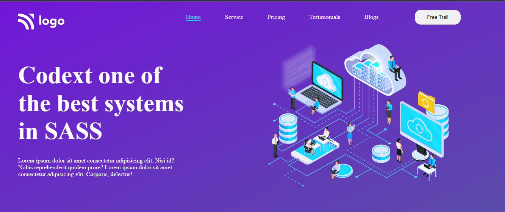

# Project 13 - HTML  and CSS 

> 
>
> By Naga Rajasekhar

You can find the live deployment link of this web page below

# [Live Deployment Link](https://sassconsultancyfirm.netlify.app/)

 
 

 

### Learnings from completing this project

1. Gained knowledge about postions and its properties 
2. Learnt about SVG's
3. Gained knowledge about background and its properties
4. Gained knowledge about padding, margin, colors, border and their values

 

# It took around 8 hours to design this web page
